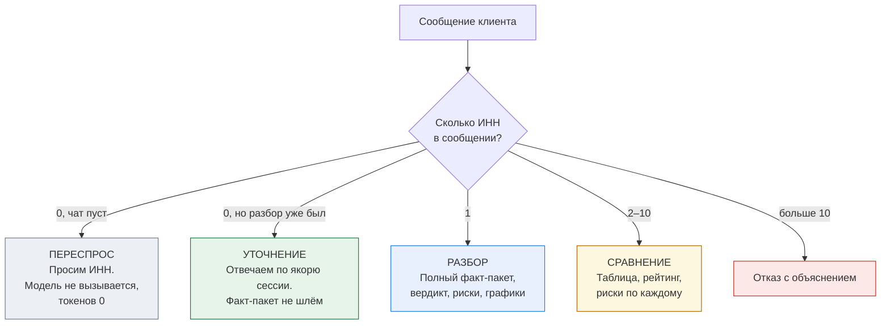
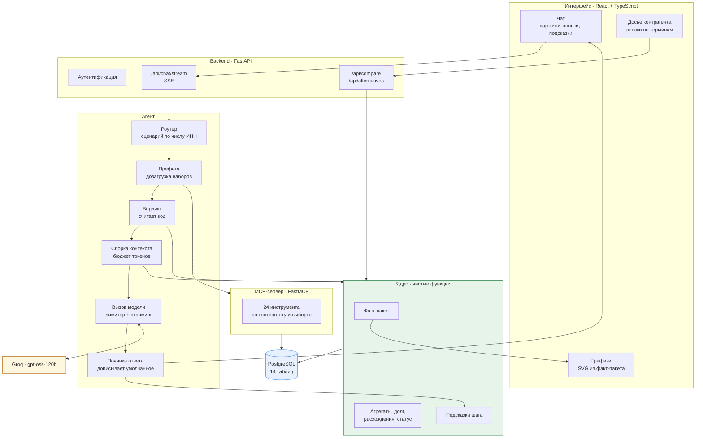
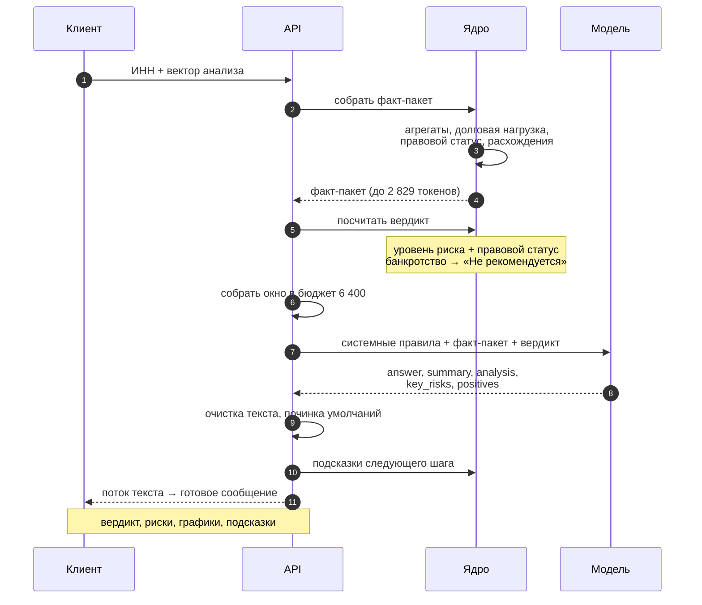
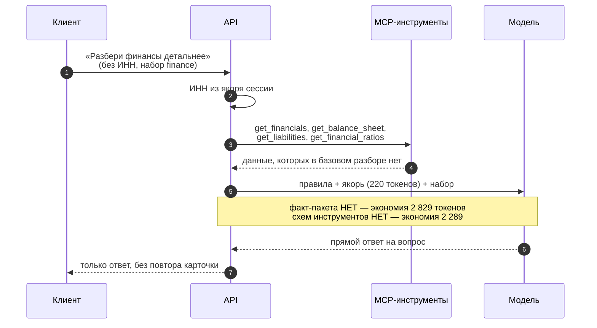
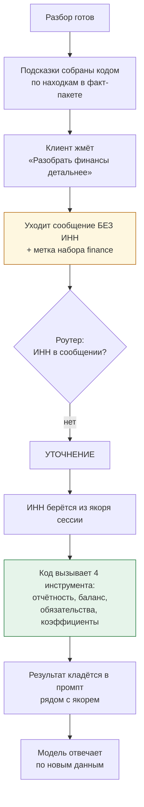
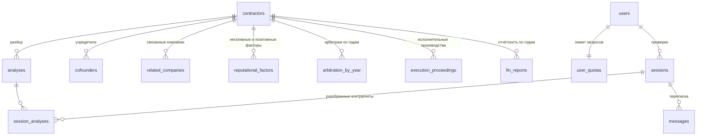
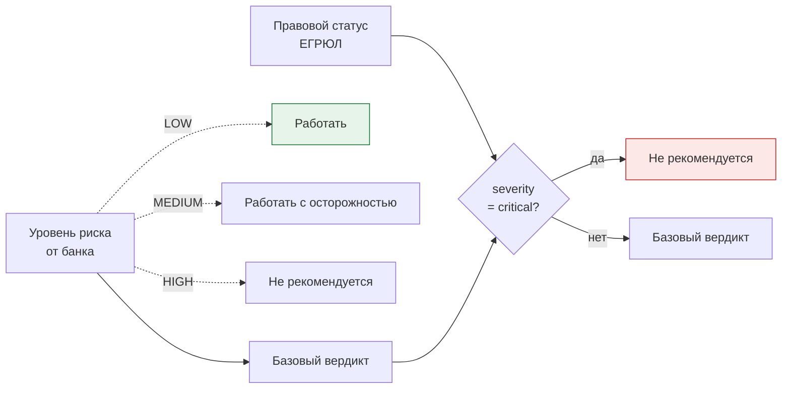
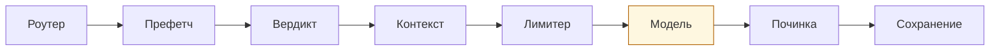

# Проверка контрагентов с ИИ — архитектура и возможности

Единый документ по проекту: что система даёт клиенту, как устроена, из чего
собрана и как её показать. Описывает реализованное, а не планы.

---

## 1. Задача

**У клиента.** Банк отдаёт отчёт по контрагенту в виде длинного PDF. Прочитать
его целиком некогда, а решение «платить или нет» принимать надо. Клиент видит
светофор и десятки полей, но не видит, что из этого для него важно.

**У банка.** Клиенты уходят на этапе между проверкой контрагента и платежом:
отчёт отдан, а дальше человек остаётся один на один с таблицей.

**Что делает система.** Разбирает отчёт за клиента, называет риски человеческим
языком и отвечает на вопросы по нему в диалоге. Решение остаётся за клиентом —
система показывает, на чём это решение можно построить.

### Принцип, на котором всё держится

> **Все факты, числа и вердикты считает код. Модель только формулирует текст.**

Модель не имеет доступа к базе, не делает арифметику и не пересматривает оценки
банка. Это снимает главный риск ИИ в финансовом продукте: агент не может
придумать цифру, потому что не умеет их получать иначе как от кода.

---

## 2. Что умеет система

| Возможность | Что даёт клиенту |
|---|---|
| **Разбор одного контрагента** | Вердикт, риски и сильные стороны словами, график выручки |
| **Сравнение 2–10 контрагентов** | Таблица показателей, рейтинг по риску, риски по каждому отдельно |
| **Диалог по отчёту** | Ответ на конкретный вопрос с числами: «взыскания — 0,003 % от оборота» |
| **Углублённые разборы** | Дозагрузка финансов, судов, владельцев, деятельности по кнопке |
| **Подбор альтернативы** | Если контрагент не подошёл — компании того же профиля без тех же проблем |
| **Вопросы к контрагенту** | Список документов, которые стоит запросить, под конкретные пробелы |
| **Графики** | Выручка и прибыль по годам, активы, взыскания, долг против капитала |
| **Сноски по терминам** | 16 определений: ЗСК, чистые активы, исполнительное производство |
| **Подсказки следующего шага** | До пяти кнопок после каждого ответа, собранных кодом по находкам |

### Чего система намеренно не делает

* **Не решает за клиента.** Формулировок «работайте с ним» нет ни у кода, ни
  у модели.
* **Не пересматривает оценки банка.** Уровень риска и ЗСК объясняются, а не
  оспариваются.
* **Не ищет по названию, отрасли или региону.** Работа идёт по ИНН: свободный
  поиск раскрыл бы состав базы.
* **Не считает отсутствие данных недостатком.** Пропуск — это отсутствие
  информации, а не плохой показатель, и так и проговаривается.

---

## 3. Сценарии

Сценарий выбирает роутер — детерминированно, по числу ИНН в сообщении. Никакого
«угадывания намерения» моделью нет.



### Как это выглядит для клиента

**Разбор.** Клиент вставляет ИНН → получает вердикт с цветной плашкой, шапку
с именем и светофорами, текст разбора, блоки «Риски» и «В порядке», график
выручки, список «что запросить у контрагента» и подсказки, что спросить
дальше.

**Уточнение.** Клиент нажимает подсказку или пишет свой вопрос → получает
**только ответ**: без повторной карточки рисков, которую уже видел.

**Углубление.** Подсказка «Разобрать финансы детальнее» подгружает отчётность
за три года, баланс и коэффициенты — данные, которых в базовом разборе нет.

---

## 4. Архитектура



**Ключевое в этой схеме:** от `Ядра` и `MCP` стрелки идут в базу, а от модели —
нет. Модель получает готовый текст и возвращает готовый текст.

---

## 5. Поток данных

### Разбор одного контрагента



### Уточнение с дозагрузкой



**Почему так.** Если факт-пакет и набор едут одним ходом, получается 7 848
токенов при бюджете 6 400 — набор молча отваливается у тяжёлых контрагентов.
Разделение хода снимает это полностью: 5 503 на разборе, 5 170 на уточнении.

### Дозагрузка по кнопкам — как это устроено

Базовый разбор намеренно узкий: факт-пакет и ничего сверху. Всё остальное
клиент подгружает **следующим ходом**, нажимая подсказку под ответом.



**Пять наборов.** Финансы, суды и взыскания, статус и владельцы, чем занимается,
что запросить у контрагента. Каждый — это два-пять вызовов MCP-инструментов,
собранных кодом заранее.

**Почему сообщение уходит без ИНН.** Это не косметика, а несущая деталь. С ИНН
роутер увёл бы ход в разбор, а разбор строит полный отчёт по шаблону и заданный
вопрос игнорирует — клиент получал третью одинаковую карточку подряд. Без ИНН
ход попадает в уточнение, где контрагент известен из якоря.

**Почему набор нельзя приложить к первому разбору.** Факт-пакет (до 2 829
токенов) плюс набор (до 2 898) плюс системные правила — это 7 848 при бюджете
6 400. Набор молча отваливался у тяжёлых контрагентов: кнопка срабатывала
на лёгком и не срабатывала на тяжёлом, и объяснить это клиенту было нечем.

**Что видит клиент.** Под ответом строка «Дополнительно изучил раздел: финансы».
Без неё у контрагента с пустым разделом ответ выглядел неотличимо от обычного,
и кнопка казалась сломанной.

**Ограничение тарифа.** Бесплатный — один набор за сообщение, расширенный —
до шести.


---

## 6. Данные

### Источник

Снапшот боевой базы кейсодателя: **100 контрагентов**, дамп MongoDB, отчёты
за июль–август 2026. Из них 75 организаций и 25 индивидуальных предпринимателей.

| Что | Сколько |
|---|---|
| Низкий риск / средний / высокий / не определён | 78 / 15 / 4 / 3 |
| ЗСК зелёный / жёлтый / красный | 81 / 18 / 1 |
| С финансовой отчётностью | 67 из 100 |
| Медиана действующих взысканий | 0 (максимум 54) |

Ловушки формата, которые пришлось учесть: даты в трёх разных видах, суммы
строками с пробелами, `null` вперемешку с нулями, поля, неприменимые к ИП,
опечатка `defandant` в исходнике.

### Хранилище



Данные контрагентов и данные клиента разведены: первые только читаются, вторые
пишутся. `analyses` хранит снимок факт-пакета — разбор воспроизводится без
пересчёта.

---

## 7. Факт-пакет — контракт между кодом и моделью

Единственное, что модель видит о контрагенте. Собирается чистой функцией
`core/factpack.build`.

```
inn, ogrn, short_name, as_of          кто и на какую дату
verdict_basis                          уровень риска, ЗСК
legal_status                           статус ЕГРЮЛ, причина, severity
debt_burden                            текущий долг, чистые активы, отношение
profile                                регистрация, возраст, размер, ОКВЭД
financials                             выручка, прибыль, баланс, коэффициенты
arbitration                            агрегаты по годам и сторонам
execution_proceedings                  действующие отдельно от истории
risk_factors                           негативные и позитивные факторы
discrepancies                          расхождения детектора
missing_data                           чего в отчёте нет
```

**Два режима.** `slim` (2 220 токенов) для бесплатного тарифа, `full`
(5 402) для платного. Отличаются глубиной, но не составом: правовой статус,
расхождения и разделение «действующее против истории» есть в обоих — на них
держится корректность вердикта.

**Никакой фильтрации по вектору анализа.** Раньше фокус «Финансы» вырезал
негативные факторы, и у 55 контрагентов из 100 от модели пряталось банкротство,
блокировки счетов и фиктивный адрес. Убрано: экономия составляла 506 токенов
при бюджете 6 400, цена — молчание о главном.

---

## 8. Вердикт — почему его считает код



Критический статус — банкротство или предстоящее исключение из ЕГРЮЛ —
переводит вердикт **сразу** в «Не рекомендуется», а не на ступень выше. Шаг
вверх давал «Работать с осторожностью» при открытом конкурсном производстве:
на экране это читалось как противоречие.

**Светофор банка при этом не трогается.** У МАКСМАРКЕТа уровень риска остаётся
`LOW` — меняется только производный вердикт. Цвет плашки берётся из вердикта:
зелёный, жёлтый, красный.

---

## 9. MCP-сервер

24 инструмента поверх готовых функций ядра. Каждый возвращает JSON без свободного
текста, каждый умеет ответить «данных нет» вместо выдумывания.

| Область | Инструменты |
|---|---|
| **Ядро** (9) | базовая карточка, правовой статус, факторы риска, полный отчёт, сравнение, углублённый разбор, график, вопросы к контрагенту, подгрузка областей |
| **Финансы** (5) | отчётность, баланс, обязательства, коэффициенты, долговая нагрузка |
| **Суды** (3) | арбитраж, исполнительные производства, долговая нагрузка |
| **Статус и владельцы** (4) | метки ФНС, учредители, связанные компании, похожие |
| **Деятельность** (4) | ОКВЭД, лицензии, проверки, госзакупки |

**Инструменты разбиты на области** — это позволяет брать ровно нужное вместо
всего каталога. Внутри одного хода код вызывает два-пять инструментов одной
области и кладёт в промпт только их результат.

### Кто выбирает инструменты

**В текущей конфигурации — код, а не модель.** Схемы всех 24 инструментов
весят 7 511 токенов при бюджете хода 6 400: приложить их к запросу нельзя
физически. Поэтому нужные данные подбирает и подкладывает код, а модель
получает готовый результат.

| Ход | Инструменты у модели | Кто выбрал данные |
|---|---|---|
| Разбор | нет | Код: факт-пакет собран заранее |
| Уточнение с набором | нет | Код: набор подобран по нажатой кнопке |
| Сравнение | нет | Код: сводка посчитана заранее |

Со схемами в промпте модель тратила ход на выбор инструмента и отвечала
фрагментом в 120 символов; без них на тех же данных ответ получается полным.

**Что это даёт.** Модель не может запросить лишнего, не может уйти по базе
за пределы сессии и не тратит ход на выбор источника. Цена — выбор источника
не адаптивный: набор тем задан кнопками, а не решением модели.

**Контур для выбора моделью в коде есть** — профиль с `attach_tools`, каталог
схем, диспетчер с белым списком ИНН, `load_tools` для подгрузки области
по требованию и цикл «вызов → результат → модель». Он не включён: в бюджет
хода на бесплатном ключе поставщика (8 000 токенов в минуту) схемы вместе
с данными не помещаются.

**Белый список ИНН** работает в любом случае: диспетчер пропускает вызов только
по контрагентам, которые назывались в сессии или пришли из ответа предыдущего
инструмента.

Регрессия: 2 900 вызовов по всей базе, 0 ошибок.

---

## 10. Агент

Конвейер вместо графа состояний — сценариев четыре, переходы линейные, LangGraph
здесь добавил бы слой без выигрыша.



### Что происходит на каждом шаге

**Роутер** — сценарий по числу ИНН, словарь ключевых слов для вектора анализа.
Сравнение по границе слова, а не по подстроке: «иск» внутри «рискует» давал
ложные срабатывания.

**Префетч** — код сам вызывает MCP-инструменты и кладёт **результат** в промпт.
Модель не выбирает инструмент и не тратит на это ход.

**Контекст** — окно собирается под бюджет: системные правила, якорь сессии,
история, блок хода. Якорь никогда не обрезается — в нём ИНН, вердикт, светофоры
и все расхождения, 220 токенов.

**Лимитер** — минутное окно поставщика 8 000 токенов. Резерв перед запросом,
запись фактического расхода после, ожидание с явной стадией «жду окно модели».

**Починка** — если модель умолчала о банкротстве или расхождении, код дописывает
готовую строку. Проверка «упомянуто?» широкая: модель говорит «несостоятельность»
там, где код ждал «банкротство».

### Бюджет

| Ход | Максимум по базе | Бюджет 6 400 |
|---|---:|---:|
| Разбор | 5 503 | запас 897 |
| Уточнение с набором | 5 170 | запас 1 230 |
| Сравнение пары | 2 202 | запас большой |

Переполнений на 100 контрагентах × 5 наборов — ноль.

### Тарифы

| | Бесплатный | Платный |
|---|---|---|
| Факт-пакет | slim | full |
| Наборов за сообщение | 1 | 6 |
| Сравнение до | 3 | 10 |

Граница проведена так: **риск не платный, платная — глубина разбора**. Вердикт,
банкротство и расхождения одинаковы на обоих тарифах.

### Отчёт без модели

Если поставщик недоступен или лимит исчерпан — ход не падает. Код отдаёт
детерминированный отчёт из того же факт-пакета: вердикт, вводные строки,
расхождения, список вопросов к контрагенту. Клиент видит пометку «ИИ-разбор
недоступен. Ниже — данные отчёта», а не ошибку.

---

## 11. API

| Метод | Путь | Назначение |
|---|---|---|
| POST | `/api/auth/login` | вход, токен на 24 часа |
| GET | `/api/me` | профиль, тариф, остаток квоты |
| GET POST | `/api/sessions` | список и создание проверок |
| PATCH DELETE | `/api/sessions/{id}` | вектор анализа, удаление |
| GET | `/api/sessions/{id}/messages` | история с пагинацией |
| **POST** | **`/api/chat/stream`** | **основной ход, SSE** |
| POST | `/api/chat` | тот же ход без стриминга |
| GET | `/api/sessions/{id}/analyses` | разобранные контрагенты |
| GET | `/api/sessions/{id}/report/export` | выгрузка разбора |
| GET | `/api/contractors/{inn}` | факт-пакет для досье |
| POST | `/api/compare` | сравнение вне диалога |
| POST | `/api/alternatives` | подбор похожих без рисков |
| GET | `/api/health` | проверка живости |

**Стриминг.** События `stage` (что делаю сейчас), `delta` (кусок ответа), `done`
(готовое сообщение с блоками), `error`. Первое поле JSON вынимается собственным
сканером по мере поступления — модель отдаёт объект, а клиент видит текст сразу.

---

## 12. Интерфейс

**Стартовый экран.** Шесть карточек сценариев, четыре на виду. Карточка задаёт
готовую фразу и вектор анализа — клиенту остаётся вписать ИНН.

**Ряд векторов под полем ввода.** Общий обзор, финансы, суды и взыскания, статус
и владельцы, чем занимается. Данных не добавляют, меняют акцент ответа.

**Сообщение.** Плашка вердикта, шапка с именем и светофорами, текст, блоки рисков
и сильных сторон, графики, вопросы к контрагенту, подсказки следующего шага.

**Досье справа.** Полная карточка контрагента со сносками по терминам.

**Графики рисует фронт** из уже полученного факт-пакета: линейные с раздельными
осями для выручки и прибыли, столбиковые для счётчиков и для сопоставления долга
с капиталом. Токенов не стоят.

**Язык.** Ни одного кода источника на экране: `CURRENT` → «Действующее»,
`LOW` → «низкий риск», `GREEN` → «зелёный». Технические термины объясняются
сносками, а не остаются как есть.

---

## 13. Инженерные решения, за которыми стоят замеры

| Решение | Почему |
|---|---|
| Вердикт считает код | Модель не может ошибиться в том, чего не вычисляет |
| Факт-пакет вместо доступа к базе | Ответ ограничен переданным; выдумать цифру неоткуда |
| Наборы данных на уточнении, не на разборе | 7 848 против бюджета 6 400 при сложении |
| Схемы инструментов сняты с уточнения | С ними модель отвечала фрагментом в 120 символов |
| ИНН не подставляется в подсказки | С ним роутер уводил ход в разбор, и вопрос игнорировался |
| Фильтрация факт-пакета по вектору убрана | Прятала банкротство у 55 контрагентов из 100 |
| Расхождения дописываются кодом | Модель умалчивала о банкротстве при зелёном светофоре |
| Конвейер вместо графа состояний | Четыре сценария, линейные переходы |
| Чистка потока, а не готового ответа | История обязана совпадать с показанным на экране |

---

## 14. Стек

**Backend.** Python 3.11, FastAPI, SQLAlchemy 2.0, PostgreSQL 16, FastMCP,
httpx. Модель — Groq `openai/gpt-oss-120b`, бесплатный тариф: 8 000 токенов
в минуту, 200 000 в сутки.

**Frontend.** Vite, React 18, TypeScript, `@alfalab/core-components`. Графики —
собственный SVG без библиотек.

**Структура.**

```
src/
  core/       чистые функции: факт-пакет, агрегаты, вердикт, подсказки
  db/         модели и репозитории; данные контрагентов и клиента разведены
  mcp/        24 инструмента поверх ядра
  agent/      роутер, префетч, контекст, лимитер, вызов модели, починка
  webapp/     FastAPI: маршруты, схемы, зависимости
  ui/         React-приложение
config/       настройки; секреты только через .env
scripts/      загрузчик снапшота в базу
docs/         этот файл и снапшот исходных данных
```

---

## 15. Запуск

```bash
# 1. База
docker compose -f devops/docker-compose.yml up -d

# 2. Зависимости и данные
python -m venv .venv && source .venv/bin/activate
pip install -r requirements.txt
python -m scripts.load_data

# 3. Backend
python app.py serve            # http://localhost:8000

# 4. Frontend
cd src/ui && npm install && npm run dev    # http://localhost:5173
```

`.env` рядом с `.env.example`: доступ к базе, `LLM_API_KEY`, `AUTH_LOGIN`
и `AUTH_PASSWORD`. Без ключа модели приложение работает в режиме отчёта без
ИИ-разбора.

---

## 16. Демонстрация

Пять кейсов, каждый показывает свою сильную сторону. ИНН реальные, из базы.

### Кейс 1. Зелёный светофор при банкротстве

**ИНН 5032257375 — ООО «МАКСМАРКЕТ»**

*Что делаем.* Вставляем ИНН, нажимаем отправить.

*Что ожидаем.* Красная плашка «Не рекомендуется». В тексте — банкротство
и открытое конкурсное производство. В рисках — 54 действующих взыскания,
блокировки счетов, фиктивный адрес, недостоверные сведения.

*Что демонстрируем.* Формально у контрагента **низкий риск и зелёный ЗСК** —
именно это клиент увидел бы в отчёте банка. Система не оспаривает оценку, но
поднимает наверх правовой статус, который её перевешивает. Это тот случай, ради
которого решение и делалось.

### Кейс 2. Ответ на конкретный вопрос

**Продолжение первого кейса**

*Что делаем.* Нажимаем подсказку «Насколько велики взыскания».

*Что ожидаем.*

> «54 активных исполнительных производства на 4,0 млн ₽. Оборот за 2023 —
> 116 257,9 млн ₽. Взыскания составляют примерно **0,003 % от оборота**…»

*Что демонстрируем.* Агент не пересказывает разбор, а сопоставляет величины
и отвечает по существу. Блоки рисков при этом не повторяются — на экране только
ответ.

### Кейс 3. Сравнение и прямой ответ «кто лучше»

**ИНН 772377037026 и 5032257375**

*Что делаем.* Пишем «Сравни 772377037026 и 5032257375, с кем стоит работать».

*Что ожидаем.* Таблица: выручка, прибыль, чистые активы, долг к активам,
взыскания, суды всего и текущие иски, негативные факторы, ЗСК, риск. Вердикты
разного цвета в одной колонке. Под таблицей — риски и сильные стороны по каждому
отдельно. В тексте — прямой ответ на заданный вопрос.

*Что демонстрируем.* Рейтинг считает код. При равенстве система так и говорит:
«по этому критерию разницы нет» — вместо выдуманного первого места.

### Кейс 4. Подбор альтернативы

**Продолжение первого кейса**

*Что делаем.* Нажимаем «Найти похожих без таких рисков», затем «Поискать по всей
стране».

*Что ожидаем.* Две-три компании того же вида деятельности — действующие, без
банкротства, без взысканий и незавершённых исков. У каждой кнопка «Проверить»,
которая сразу запускает полный разбор.

*Что демонстрируем.* Клиент не остаётся ни с чем. Отбор идёт только по открытым
реестрам — оценка банка по этим компаниям не раскрывается, её клиент получает
обычной проверкой.

### Кейс 5. Пустой отчёт — и это нормально

**ИНН 772377037026 — ИП Касаткин А. В.**

*Что делаем.* Вставляем ИНН.

*Что ожидаем.* Вердикт «Работать». В рисках — отсутствие отчётности и контактных
данных. В блоке «Что запросить у контрагента» — бухгалтерский баланс и отчёт
о финансовых результатах.

*Что демонстрируем.* Отсутствие данных не выдаётся за проблему контрагента,
а превращается в конкретное действие: вот что у него спросить.

### Кейс 6. Неизвестный риск и гора судов

**ИНН 5029069967 — ООО «ЛЕ МОНЛИД»**

*Что делаем.* Вставляем ИНН.

*Что ожидаем.* Уровень риска — **не определён**. В истории 1 525 арбитражных
дел, но текущих исков к компании всего 17. Действующих взысканий 45, финансовой
отчётности нет.

*Что демонстрируем.* Главное различение системы — **история против
действующего** — на разрыве почти в два порядка. Пятнадцать сотен дел выглядят
приговором, пока не видно, что незавершённых из них семнадцать. Плюс честная
работа с неопределённым риском: система не выдаёт «не определён» за «низкий».

### Кейс 7. Здоровый контрагент

**ИНН 3711039473 — ООО «ЛИДЕРТЕКС»**

*Что делаем.* Вставляем ИНН, раскрываем «Ещё графики».

*Что ожидаем.* Зелёная плашка «Работать». Выручка 3,7 млрд ₽, прибыль 276 млн ₽,
рост три года подряд. Блок «В порядке» заполнен, рисков мало.

*Что демонстрируем.* Система одинаково убедительна и когда всё хорошо. Заодно
графики: выручка и прибыль на **раздельных осях** — иначе прибыль в 13 раз
меньше выручки прижималась бы к нулю и динамики видно не было бы.

### Кейс 8. Маркер, а не приговор

**ИНН 9721159668 — ООО «ТРАНСЛОРИУМ»**

*Что делаем.* Вставляем ИНН.

*Что ожидаем.* Система отмечает 47 кодов ОКВЭД — и тут же поясняет, что много
кодов само по себе не нарушение: компании часто заявляют смежные виды про запас.
Вердикт от этого не меняется.

*Что демонстрируем.* Разницу между «нашли отметку» и «обвинили». Кейсодатель
отдельно просил не превращать серые маркеры в красные флаги — вот как это
выглядит на практике.

### Кейс 9. Граница тарифа

**Четыре ИНН одним сообщением на бесплатном тарифе**

*Что делаем.* Пишем четыре ИНН через запятую.

*Что ожидаем.* Система объясняет ограничение человеческим языком и предлагает
сократить список — вместо кода ошибки.

*Что демонстрируем.* Продуктовую модель: бесплатно сравниваются трое, на
расширенном тарифе — до десяти. Граница проведена по глубине разбора, а не по
безопасности: вердикт, банкротство и расхождения одинаковы на обоих тарифах.

### Кейс 10. Вопрос за пределами отчёта

**Любой разобранный контрагент**

*Что делаем.* Спрашиваем: «Можно ли отгрузить ему на 5 миллионов?»

*Что ожидаем.* Система не отказывается и не выдумывает. Говорит, что размер
сделки в оценку банка не входит, и приводит то, что для такой суммы существенно:
чистые активы, действующие взыскания, наличие отчётности.

*Что демонстрируем.* Агент держит рамку ответственности — отвечает по существу,
но не берёт на себя решение, которого данные не обосновывают.

### Запасной кейс: работа без модели

Если лимит поставщика исчерпан прямо на показе — это не поломка. Система отдаёт
детерминированный отчёт с вердиктом, вводными и вопросами к контрагенту, помечая
«ИИ-разбор недоступен. Ниже — данные отчёта».
